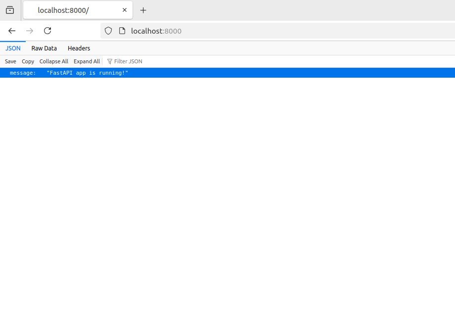

# FastAPI Production App with Docker, PostgreSQL, Redis, and Nginx

This project is a production-ready Python web application built with **FastAPI** and containerized using **Docker Compose**. It integrates:
- **PostgreSQL** for database
- **Redis** for caching
- **Nginx** as a reverse proxy
- **Uvicorn** as the ASGI server

---

## Start the services
```
docker-compose up --build
```

## App Preview
#### App up on port: 8000
#### HTTP://localhost:8000

